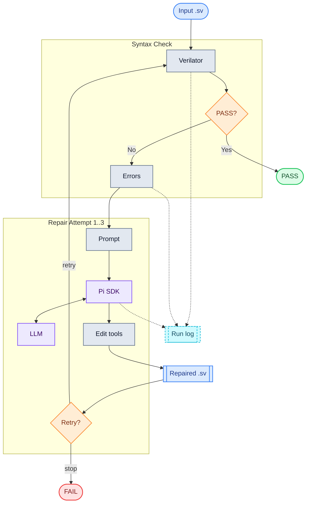

# sv-repair-agent

TypeScript CLI for automatic SystemVerilog syntax/lint repair using Verilator and Pi Coding Agent.

## Requirements

- Node.js 20+
- Verilator in `PATH`
- Pi Coding Agent SDK package

The SDK dependency is installed by `npm install`. If you also want the standalone Pi CLI:

```sh
npm install -g @earendil-works/pi-coding-agent
```

## Setup

```sh
npm install
cp .env.example .env
npm run build
```

Configure `.env` or shell environment:

```sh
OPENAI_BASE_URL=http://localhost:1234/v1
OPENAI_API_KEY=local-key
OPENAI_MODEL=qwen2.5-coder-32b-instruct
```

## Usage

```sh
sv-repair-agent --file path/to/top.sv
```

During development:

```sh
npm run dev -- --file examples/broken.sv
```

The CLI:

1. Runs `verilator --lint-only --sv <file>`.
2. Exits with `Syntax check PASS` when Verilator passes.
3. Sends Verilator errors to Pi Coding Agent when Verilator fails.
4. Streams Pi output live with timestamped `[PI]` log lines.
5. Repeats repair up to 3 attempts.
6. Prints `Syntax check FAIL` and final Verilator output if still failing.

Logs are saved under `logs/run-<timestamp>.log`.

## Docker

Build the image:

```sh
./docker-build.sh
```

Run the container against a local SystemVerilog file:

```sh
./docker-run.sh path/to/top.sv
```

The run script bind mounts the file to `/input.sv` inside the container and runs:

```sh
sv-repair-agent --file /input.sv
```

Set `OPENAI_BASE_URL`, `OPENAI_API_KEY`, and `OPENAI_MODEL` in `.env`. `docker-run.sh` reads only `.env` and intentionally ignores shell `OPENAI_*` variables. If your LLM server runs on the host machine, use a container-reachable URL such as `http://host.docker.internal:1234/v1`; `localhost` inside the container refers to the container itself.

## Repair Loop



## Pi Integration

Pi execution is isolated in `src/pi.ts`. The tool uses the Pi Coding Agent SDK directly:

- `createAgentSession`
- in-memory auth, settings, and session storage
- a dynamically registered OpenAI-compatible provider from `OPENAI_BASE_URL`, `OPENAI_API_KEY`, and `OPENAI_MODEL`
- built-in Pi coding tools: `read`, `bash`, `edit`, and `write`

If the SDK integration needs to change, update only `src/pi.ts`.
